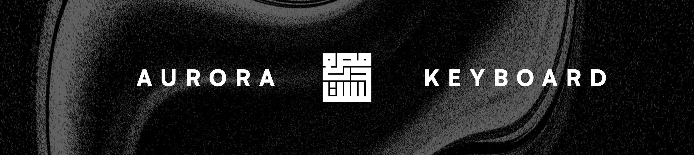
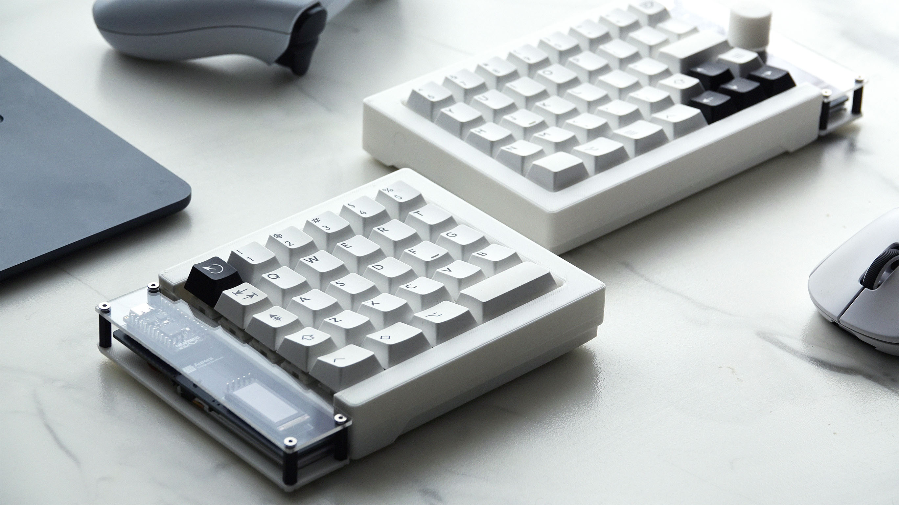
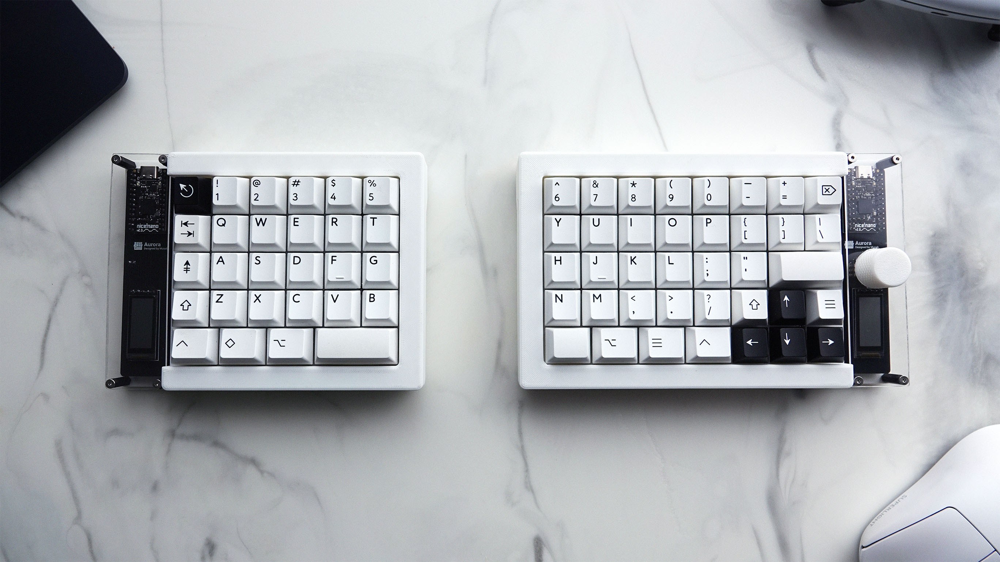

# 

The Aurora keyboard is a beautifully designed fully split, wireless, ergonomic keyboard that you can build yourself.

**The full build guide can be found in `build_guide/`.**

**Key Features:**

- Bluetooth and dongle switching
- Ortholinear layout
- 65% layout (full layout with no compromises)
- Per-key RGB (if you can solder them)
- Support for any MX switches and keycaps
- OLED Screen (nice!view)
- Volume knob
- Hotswappable
- ZMK Firmware

## Repo Contents

- **STL Case Files:** 3D-printing-ready case files. You can print these without any CAD skills.
- **SLDPART Case Files:** SolidWorks case files. Modify these to create a custom layout. (Sorry, SolidWorks is the only CAD software I'm proficient in.)
- **Completed PCB Files:** Fabrication-ready routed PCB files, modifiable in KiCAD or Altium. Export them to `.gerber` files for fabrication.
- **Ergogen Files:** Ergogen configuration files used to generate the unrouted PCB. There are two separate folders since the keyboard is asymmetrical. Modify only if fundamental PCB changes are needed.

### Not Included in This Repo

- **ZMK Config:** The ZMK Firmware configuration is stored in [a separate repository](https://github.com/Musab-Hassan/zmk-config-aurora) and is not included here.

## Case Design

The Aurora keyboard uses a [plate-mounted style](https://www.keyboard.university/200-courses/keyboard-mounting-styles-4lpp7) with a top plate and a flat bottom base for each half. The PCB, microcontroller, and nice!view screens are exposed at the open ends and are covered by an acrylic piece.

Due to its ergonomic design and full 65% layout, the cases are asymmetrical, with the right side being larger than the left.

All files were designed in SolidWorks, but they can be opened and modified in other CAD/CAM software.

### Dongle and Bluetooth Switching

The case files also include a dongle case. This dongle is a third nice!nano that functions as a keyboard dongle when connected to a computer via a USB cable or USB-C male-to-male adapter. The dongle case also includes a dongle cover, which, when glued together, allows the dongle to slot into the left side of the keyboard.

The left side features a slot for the dongle. If 3-pin magnetic pogo connector is added to the pogo connector holes within both the dongle case and the left side keyboard slot, the dongle can then magnetically attach and automatically switch to Bluetooth by using the left-side battery when it slots in.

Refer to the build guide for more details.

## PCB Design

The PCB layout and unrouted PCB were generated using Ergogen. Since the two halves have different layouts, separate folders exist for each. My Ergogen skills were not sufficient to configure both in one file.

After Ergogen, the PCB was routed in KiCAD. Routed PCB files are in the `pcb` directory and are fabrication-ready. Download the zip files from the `pcb/gerber` directory and then order them for fabrication.

You can order the PCBs from manufacturers such as PCBWay or JLCPCB.

## Parts List

This list includes all external parts required, excluding the PCB and 3D-printed case files. I’ve also provided the sources where I purchased these parts. However, they may not be the cheapest or best sources. Switches and keycaps are personal preference and should be a significant part of your budget.

### Required Parts

| Part | Quantity | Where I got them from |
| --- | --- | --- |
| nice!nano | 3 (2 if no dongle) | [Typeractive](https://typeractive.xyz/products/nice-nano) |
| nice!view | 2 | [Typeractive](https://typeractive.xyz/products/nice-view) |
| 1N4148W SMD diodes | 70 | [Typeractive](https://typeractive.xyz/products/smd-diodes) |
| MX Hotswap sockets | 70 | [Amazon](https://www.amazon.ca/dp/B0972HB9GY) |
| 750 mAh Thin LiPo Battery | 2 | [Typeractive](https://typeractive.xyz/products/lithium-battery-750mah) |
| JST PH 2.0mm Battery Jack | 2 | [Typeractive](https://typeractive.xyz/products/battery-jack) |
| EC11 Encoder | 1 | [Digikey](https://www.digikey.ca/en/products/detail/alps-alpine/EC11E15244B2/19529170) |
| 0.08" Acrylic Sheet (8" x 12") | 1 | [Amazon](https://www.amazon.ca/dp/B0BK3DN8JR) |
| Alps Micro Switch | 2 | [TyperActive](https://typeractive.xyz/products/power-switch) |
| Panasonic EVQPU Reset Button | 2 | [Typeractive](https://typeractive.xyz/products/reset-button) |
| PCB Mount Stabilizers | 4 | [KBDFans](https://kbdfans.com/collections/keyboard-stabilizer/products/cherry-clip-in-stabilizer-pcb-mount) |
| MX Switches (Preference: I chose Gateron Smoothies) | 70 | [KBDFans](https://kbdfans.com/products/gateron-smoothie-linear-switch) |
| MX Keycaps (Preference: I chose PBTFans BOW) | 70 | [KBDFans](https://kbdfans.com/products/pbtfans-doubleshot-bow) |
| M2.5 6mm Countersunk Screw | 12+ | [Amazon](https://www.amazon.ca/dp/B075RCP71G) or [McMaster Carr](https://www.mcmaster.com/92010A016) |
| M2.5 8mm Hex Standoff | 8+ | [Amazon](https://www.amazon.ca/dp/B0788FR59P) or [McMaster Carr](https://www.mcmaster.com/95947A003) |
| M2.5 14mm Hex Standoff | 8+ | [Amazon](https://www.amazon.ca/dp/B0788FR59P) or [McMaster Carr](https://www.mcmaster.com/95947A009) |

### Optional But Recommended Parts

| Part | Quantity | Why | Where I got them from |
| --- | --- | --- | --- |
| 3 Pin Magnetic Pogo Connector  | 2 | Allows dongle to magnetically snap in and switch to bluetooth | [Amazon](https://www.amazon.ca/dp/B0CPJHQK2F) |
| Rubber Feet  | 8 | Prevents keyboard from slipping | [Amazon](https://www.amazon.ca/dp/B07CNQC695) |
| Neodymium Bar Magnets (60mm x 10mm x 3mm) | 2 | Allows the keyboard to magnetically snap when connected together (case plate has a slot for magnets) | [Amazon](https://www.amazon.ca/dp/B09TKMRRRC) |
| Keyboard Lube or Di-electric grease | 1 | If you want your keyboard to sound good you can lube the switches for it to sound even better (not recommended unless you are very ambitious about keyboards) | [Amazon](https://www.amazon.ca/dp/B09B9RL1QQ) |
| Neoprene Foam Sheet | 1 | Allows you to dampen keyboard sound so it sounds better. Again not recommended unless you really like dampened keyboard sounds. | [Amazon](https://www.amazon.ca/dp/B0B88BLNGQ) |
| SK6812Mini RGB LED | 70 | RGB per key backlight. Only get these if you are very experienced with SMD soldering. They are very difficult to solder by hand. There is also no support in the Aurora ZMK configuration for RGB yet as I am unable to solder them. If you do solder them you will need to add the backlight option in the ZMK config yourself for them to work. | [ClicketySplit](https://clicketysplit.ca/products/sk6812mini-programmable-rgb-led) |

### Required Tools

- Soldering iron (preferably with temperature control)
- Solder (preferably nothing larger than 0.8mm)
- Flux (optional but recommended)
- Tweezers
- FDM or Resin 3D Printer or at least access to one
- Screw driver with the appropriate bit depending on your screws

## License

GPL V3 License

Have fun with your build!
