# Soldering the PCB

This part of the guide will walk you through the process of soldering all the necessary components onto the PCB. Follow each step carefully to ensure the keyboard functions properly. If you have a voltmeter, you can perform continuity checks to ensure that all your joints are solid.

## Required Tools and Materials

For this part, you will require the following tools from the README. Ensure you use the correct soldering temperature for your solder (usually higher than 400°C is good). Cold joints will cause problems.

- Soldering iron (preferably with temperature control)
- Solder (preferably nothing larger than 0.8mm)
- Flux (optional but recommended)
- Tweezers

## Board Orientation

Throughout this soldering guide, there will be references to the board back, front, left, and right. It's important to understand what these mean.

The shorter PCB is the "left PCB," while the longer PCB is the "right PCB." Both of these PCBs have solder points on the front and the back. The front of both PCBs is where the logo and the screen are located (see picture below).

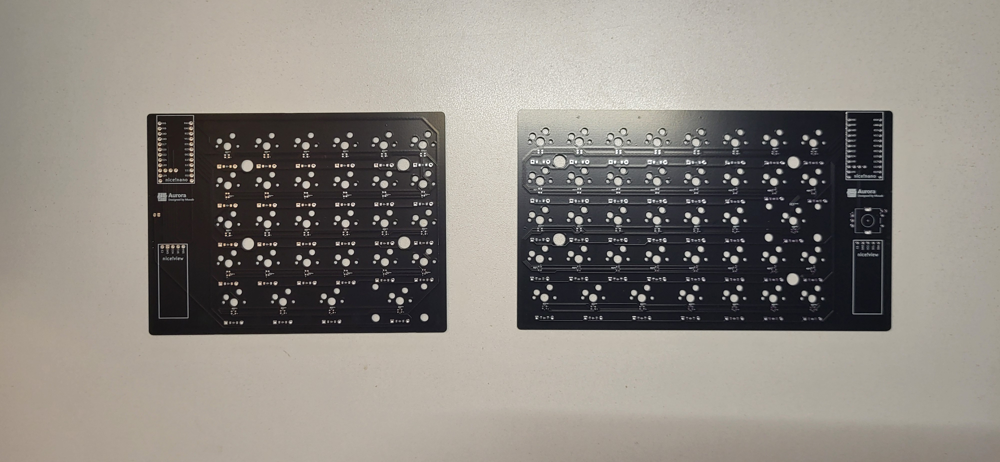

The bottom side is where the diodes and other hidden components go (see picture below).

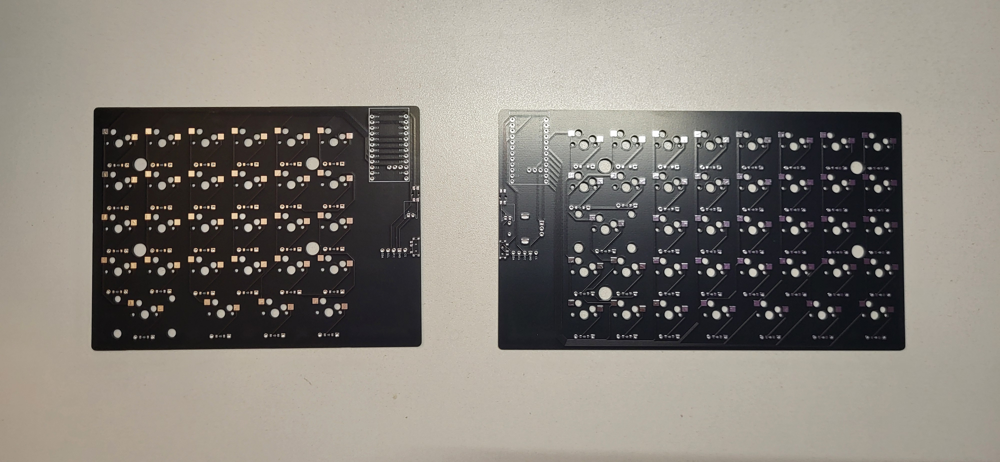

## Step-by-Step Soldering Guide

### Before Starting

If you plan to have per-key RGB backlighting, start by soldering the LEDs. These are surface-mount components and require precision, so doing them first ensures nothing gets messed up once everything else is soldered on. The pads are labeled in the PCB schematic, and you must align them appropriately. For this step, you are on your own as this is the only component I have not added to my build. The ZMK configuration will also need to be modified when you get to Firmware Flashing.

If you do not want to modify the firmware configuration or don't care about RGB, you can skip this step.

### 1. Solder Diodes

Start by soldering the diodes. Each key needs a diode. You can find the diode pads on the back side of the PCB.

Ensure the diode line aligns with the cathode on the solder mask image (see image below).

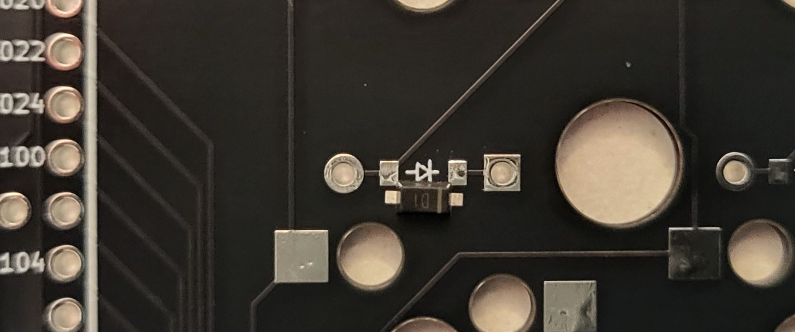

Make sure you solder them on both PCBs.

> #### Why do we need diodes?
>
> Each key is connected to a column and a row, which identifies it to the microcontroller. This "matrix" allows a lot of keys to exist without using many pins on a microcontroller. Diodes ensure that when a key is pressed, it is always detected even when multiple keys are pressed.

### 2. Solder Hotswap Sockets

The next step is to solder the hotswap sockets to their pads. The hotswap socket pads are located on the same side of the PCB as the diodes. Just like diodes, each key needs a hotswap socket.

Hotswap sockets allow you to easily click in switches and replace them in the future without having to desolder them each time.

The sockets will fit in both orientations, so ensure you orient them in a way that does not block the stem hole for your switches. See the image below for the correct orientation.

|❌ Wrong Orientation|✔️ Correct Orientation|
|--|--|
|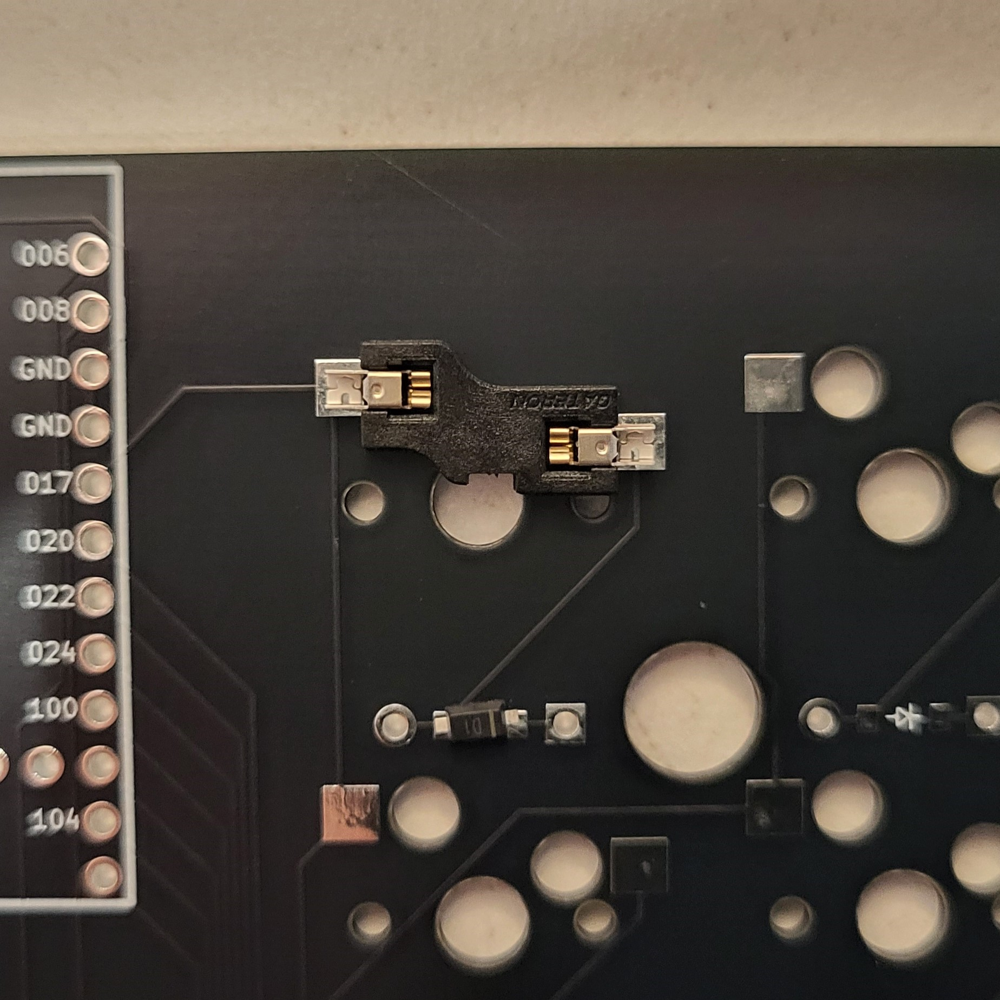|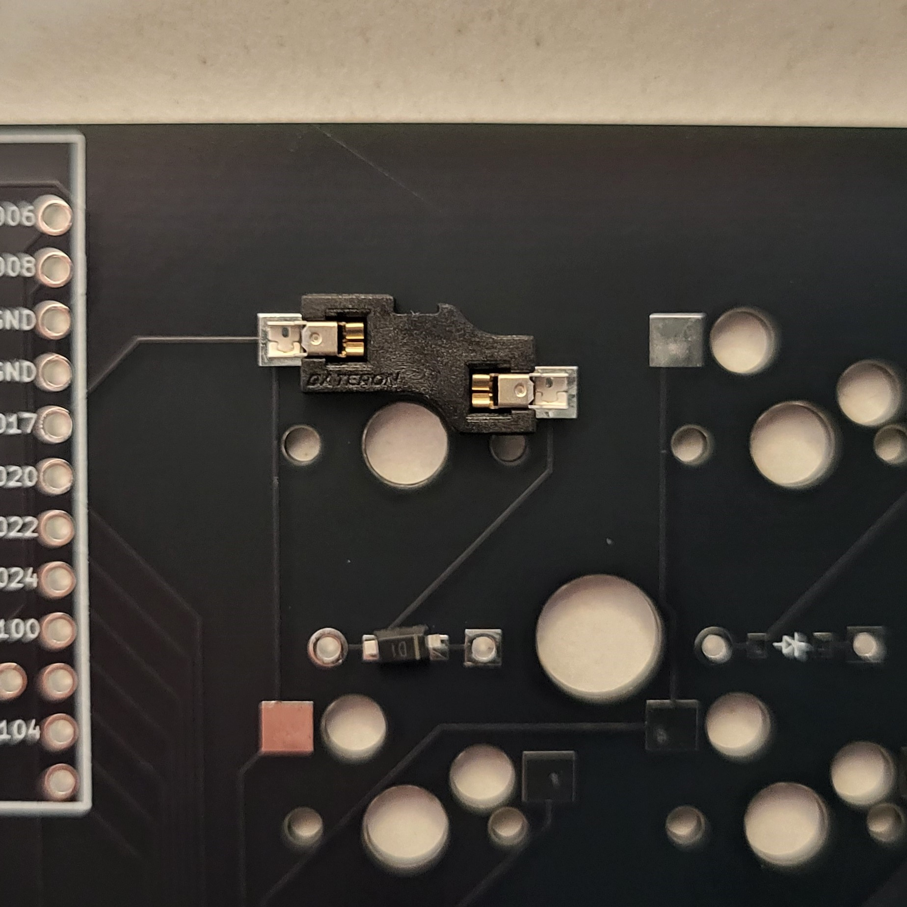|

Make sure you solder them on both PCBs.

### 3. Solder Power and Reset Switches

Similar to the diodes, continue by soldering the legs on both the power and reset switches. There is only one correct orientation for them, so this step should be easier compared to soldering diodes.

Your final soldered joints should look something like this:

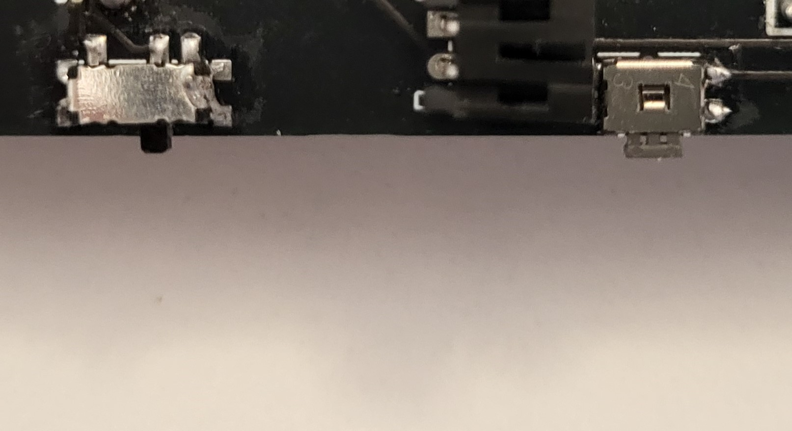

Make sure you solder them on both PCBs.

### 4. Solder Both nice!nanos

The next step is to solder the nice!nano microcontroller onto both boards. The microcontroller should come with three pin headers. Slot them into their respective holes on the front of the PCB and solder the legs sticking out on the back side of the PCB. Ensure the other end of the pins sticks out on the top and not the bottom, as the microcontroller will be soldered onto them.

After soldering the headers, slide the microcontroller onto the pins exposed on the top and solder each pin on the microcontroller. Ensure you make proper joints with a reasonable amount of solder, as cold joints here can cause problems.

The top side should now look like this:

|Front|Back|
|--|--|
|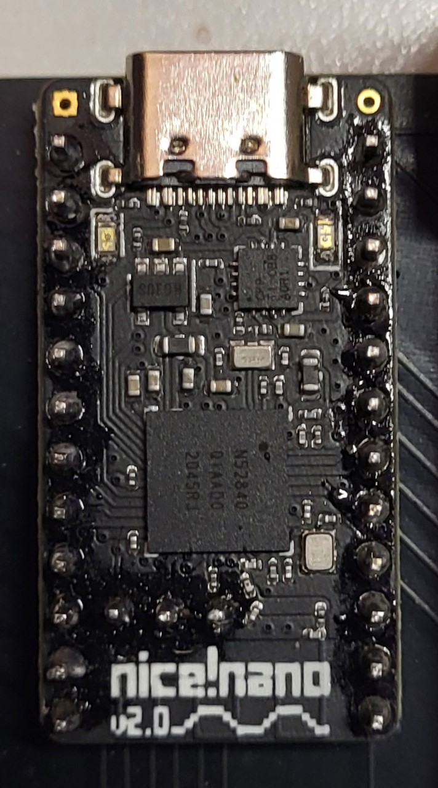|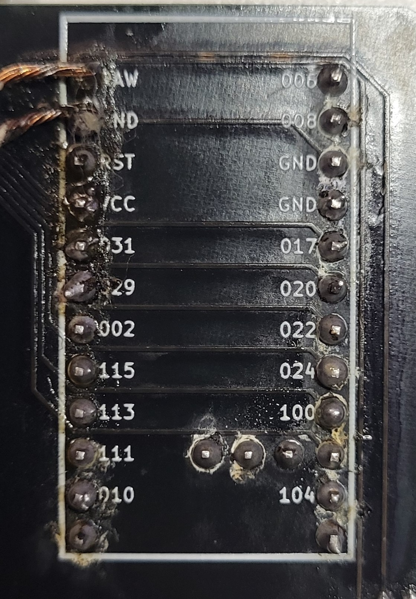|

Make sure you solder a nice!nano on both the right and left PCBs.

### 5. Solder Screens

Just like the microcontroller, the nice!view screens should also come with one pin header each. Slot this pin header into its hole and solder the exposed pins on the back of the board.

After soldering the headers, slide the nice!view screens onto the pins exposed on the top and solder each pin. Ensure you make proper joints with a reasonable amount of solder, as cold joints here can cause problems.

Your final solder points should look like this (the mess is because of flux and definitely not because of my soldering skills):

|Front|Back|
|--|--|
|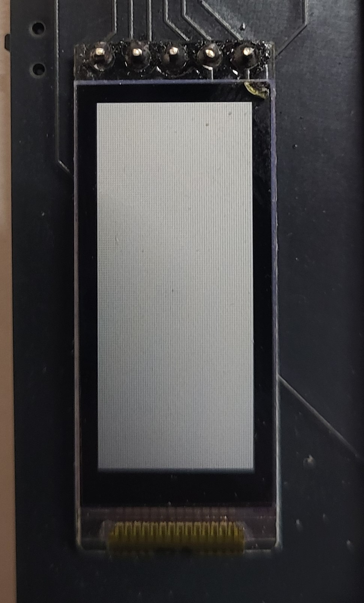|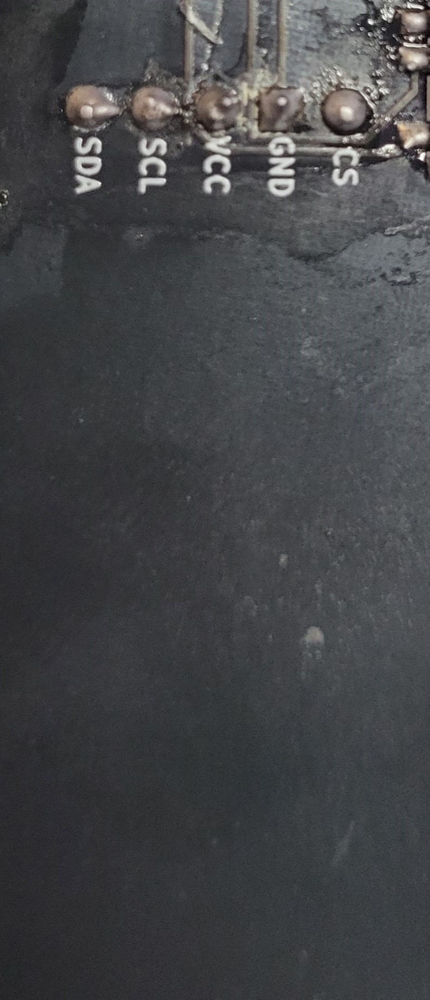|

### 6. Solder JST Jack

Before starting this step, ensure your battery has a male jack to so it can connect to the JST Jack. If it does not (bare wires), you will need to purchase a battery connector and add it to the battery end so it can be connected to the jack. You can also skip this step by just soldering the battery wires directly to the JST Jack holes, however I would not suggest this as this will make future repairs annoying.

If you do have a connector, you can start soldering the JST battery jack now.

Align the JST battery jack on the back side of the PCB. Ensure it is oriented according to the direction marked on the PCB. The exposed pins should stick out on the front of the PCB, where you will solder them. If you solder the jack in the wrong orientation, the battery will not be able to power the microcontroller.

Do not plug in the battery yet; we will do this later during the case assembly.

The final soldered jack should look like this:

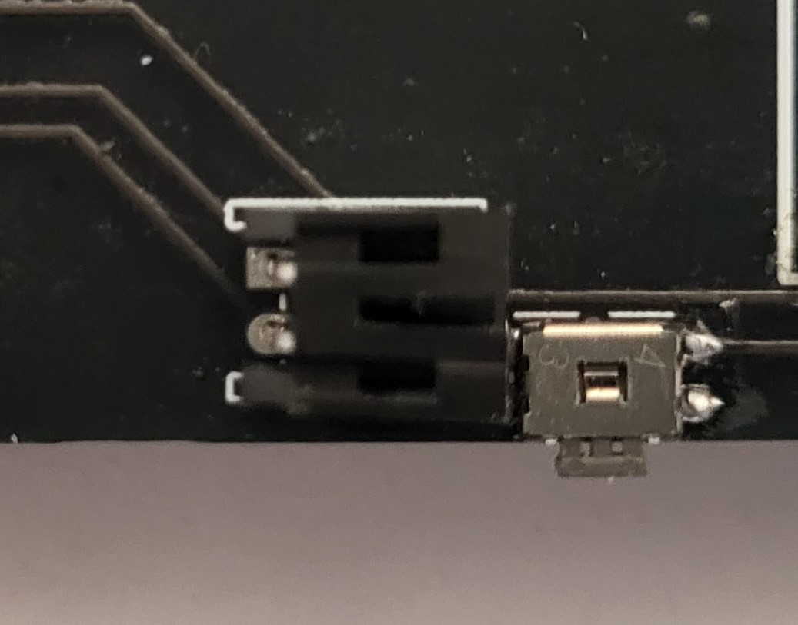

Once soldered to both sides, the left PCB is complete. The right PCB just needs one last component to be soldered.

### 7. Solder Right Encoder

Finally, solder the rotary encoder to the right PCB. The encoder should face the front with its legs and pins pushed through their holes.

Once inserted, solder the exposed pins on the back. Leave the legs as they are, as they provide stability but do not have any electrical connections.

### 8. Mount your stabilizers

We are now done with soldering however we do need to add one last component which is mounting our stabilizers to the PCB. The wider keys such as the space bar on the left and the enter on the right side need them to not wobble when they are pressed.

You can find tutorials online on how to mount stabilizers to a PCB (I suggest [this tutorial](https://www.youtube.com/watch?v=kWlRucYPb5g)). I would also highly suggest [lubing and then adding some dampening material](https://www.youtube.com/watch?v=-vhpHjlkRgQ) under your stabilizers to reduce rattling when you press the larger keys.

## Final Checks

As part of the final checks:

- Inspect all solder joints for cold solder or bridges.
- Ensure all components are securely attached.

Congratulations! You’ve successfully soldered the PCB for your Aurora Keyboard.
