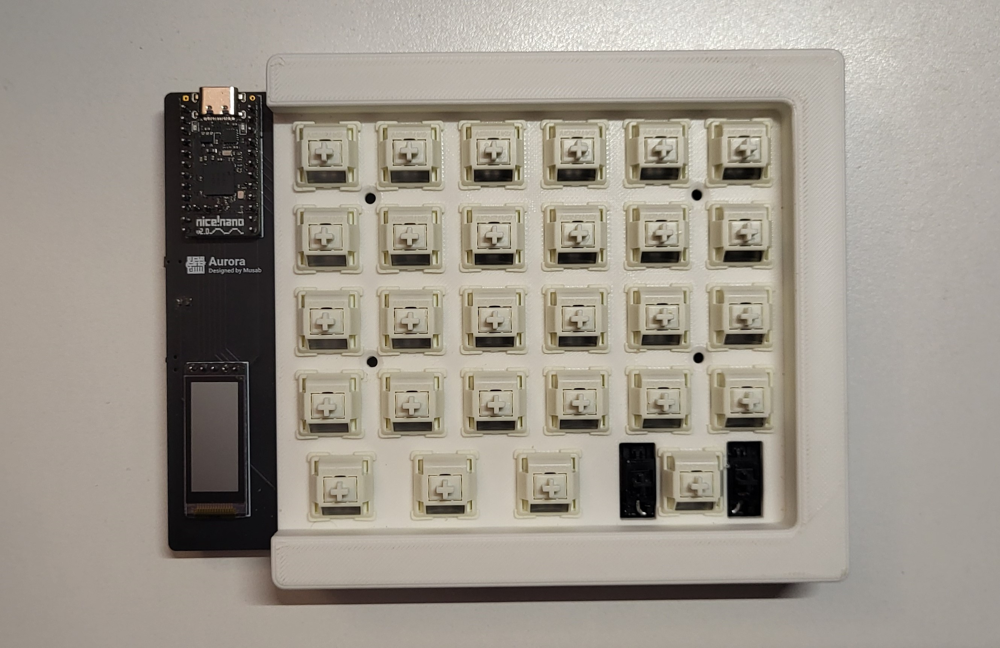
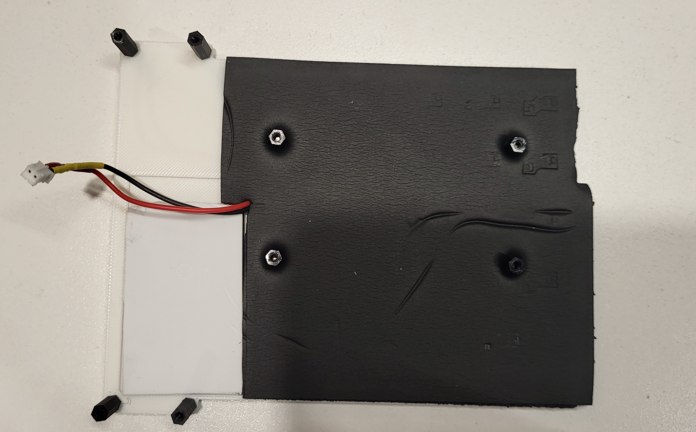

# Case Assembly

Assembling the case is the final step in building your keyboard's hardware. This is where you will secure all the components together and have a ready to use keyboard. Follow each step carefully to ensure your build turns out beautiful.

## Required Tools and Materials

For this part, you will only need a screwdriver with a bit appropriate for the screws you purchased.

Also, ensure you have all the printed case STLs with all support material removed.

The printed files required for this part are:

- Left Plate (provided as STL)
- Right Plate (provided as STL)
- Left Base (provided as STL)
- Right Base (provided as STL)
- Right Encoder Knob ([Get from Printables](https://www.printables.com/model/347536-encoder-knob))

You can also resin print the "acrylic_cover" files; however, I would advise getting them laser-cut in acrylic or hand-cutting them from an acrylic sheet using a drill and snapping them. See the acrylic piece step below for more details on how to do this.

## Step-by-Step Case Assembly Guide

### 1. Click in Switches

The PCB is a floating PCB, meaning it has no support from underneath or above and is held to the case exclusively by the switches clicked in from the top plate. This simplifies assembly and prevents 3D printing imperfections from interfering with PCB spacing.

To begin assembly, align the PCB with the top plate. Align the hotswap sockets with the cutouts for each key in the plate and start pushing in switches from the top. Do this evenly by starting from each corner and then working toward the middle. Once they are all aligned, give them a firm push to ensure they are properly seated within the hotswap sockets on the PCB. As you insert more switches, the PCB will become more securely attached to the top plate.

Your final PCB and plate assembly should look like the following image.

Ensure this is done for both halves.

**Optional Feature:** There is a slot under the plate to add a neodymium magnet so your keyboard can magnetically attach to the other half when it gets close. You can slot your magnet here (ensure it's in its correct orientation so it attracts) and just hot glue it so it stays secure.

### 2. Prepare Base

Now, prepare the base for mounting with the top plate.

Start by screwing four M2.5 8mm Hex Standoffs with screws from the bottom of the base where the plate holes and base holes align.

Next, screw four M2.5 14mm Hex Standoffs into the end holes where the acrylic piece will be screwed on top.

Lastly, apply [thin double-sided tape](https://www.amazon.ca/dp/B00BXYWXY8) to the cavity in the base where the battery will sit. Align the battery to the bottom and left of the cavity and tape it down with the double-sided tape.

As an additional layer of protection, tape a small piece of thin foam (often included with switches) on top of the battery. This prevents accidental punctures from exposed pins and keeps the battery safe from pressure or sharp contacts.

Ensure you repeat this for both sides and both batteries.

Your prepared base should look like the following image:

**Optional Features:** As an extra noise damper, you can add a layer of Neoprene foam (listed in optional parts) to the base to help with noise reduction and change your keyboard's sound profile. You can also add rubber feet to the bottom to reduce slipping. I have included both in my build, which you can see in the image below.

### 3. Screw Top Plate to Base and Attach Acrylic Piece

The next step is to screw the top plate to the base. Align the top plate holes with the standoffs on the base and secure them with screws from the top. **Make sure to plug in the battery to the PCB before doing this.**

Once assembled, screw the acrylic pieces onto each side using the exposed standoffs. Ensure the piece with the hole is attached to the right side, as that is where the encoder stem should stick out.

If you are cutting the acrylic piece by hand, use a high-speed drill and the correct-sized bits. Snap your acrylic sheets to the required size (3D print the *acrylic_shield.stl* file to use as a template), then drill the necessary holes. If using a laser cutter, you must **countersink** the holes so the screws fit properly.

### 4. Attach Keycaps and Encoder Knob

The final step is to attach your keycaps and rotary encoder knob. These can simply be pressed in and require no additional assembly.

You can also perform this step **after flashing your firmware**, which I recommend, as it will make disassembly easier if something does not work correctly after flashing.

The build is now complete, and your keyboard is ready to be powered on.

The final assembly should look like the following image:

## Final Checks

Before using your keyboard, perform these final checks:

- Ensure all screws are properly tightened but not over-tightened.
- Verify that the battery is securely taped and protected with foam.
- Check that all switches are fully seated in their hotswap sockets.
- Ensure the encoder knob is attached and rotates smoothly.
- Confirm that the acrylic cover is correctly positioned and screwed in.

Once all checks are complete, your Aurora keyboard is fully assembled and ready for firmware flashing!
